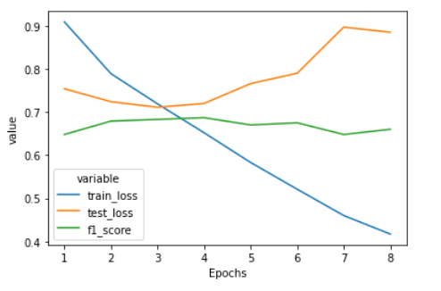

# Introduction 

Mixing languages is very common among multilingual people. Multilingual
people, who tend to be non-native English speakers tend to mix English
or second language based phonetic typing and terms into their first
language. This poses a great challenge to conventional deep and machine
learning techniques because traditionally, they have been targeted
towards a single language.

I propose a deep learning based solution that make use of BERT for this
problem. Different pre-trained versions of Multilingual BERT and
Hinglish-BERT were put into test. It turns out that transformers are
very data hungry models and on a short training set, their
generalization capabilities are adversely affected turning them into
crammers. Regularization techniques are further explored to overcome
this.

# Approach

In the modern deep learning era, recurrent neural networks have been
rendered obsolete since the advent of transformers.
Attention[@Bahdanau_2014] has proven to be the game changer in the field
of natural language processing. The main intuition behind attention was
letting the decoder component of the neural translator give different
levels of attentions instead of same to those words that came before it
to predict the next word in the sequence. Vaswani et al. [@Vaswani_2017]
dispensed recurrences and convolutions completely in the favor of
attention mechanisms and obtained new state of the art results on the
task of machine translation. Transformers are more parallelizable,
require less time for training and are able to generalize better than
other contemporary approaches which make them the go-to choice for any
natural language processing task.

## BERT

Bidirectional Encoder Representations from Transformers or BERT
[@Devlin_2019] is a new language representation model from Google. BERT
is trained on two tasks; at sentence level, to predict whether a
sentence succeeds a given sentence and at word level, to predict the
masked word in a sequence. BERT is bi-directional which means it takes
the context from both sides into consideration before making a
prediction. As a result, the pre-trained BERT model can be fine-tuned
with just one additional output layer to create state-of-the-art models
for a wide range of tasks, such as question answering and language
inference, without substantial task-specific architecture modifications.

With the burgeoning of transfer learning, the new trend is to train a
large model on large datasets(pre-training) first and fine-tune that to
downstream tasks later. This idea is further explored by Turc et al
[@turc2019wellread].*Well-Read Students Learn Better* succinctly sums up
their findings. Different pre-trained versions of BERT were tried and
evaluated. The details are described in the subsequent sections.

## Preprocessing

The tweets dataset comes from an open and informal distribution, the
social media itself. Tweets are full of noise in the form of emojis,
usernames, hashtags and url links. Moreover, it was observed that there
is a large difference in terms of vocabulary between the training and
test set. The train and test set consist of 60,000 and 25,000 unique
words and the number of common words between them is just above 10,000.
The noise also exists at word level, as people tend to add multiple
copies of the same letter at the end of a word e.g 'goodddddd' to
reinforce sentiments and connotations. Most of the noise was removed
using regex but it still remains a challenge to find a pattern that
removes all the noise from tweets.

## Training

For training, three different Colab notebooks were used on three
different google accounts for trying different ideas, models and
hyper-parameters simultaneously. Colab notebooks provides free access to
GPU with 12GB of VRAM which significantly improves training times. I
used HuggingFace's transformers API to fine-tune different transformers
based models like BERT and AlBERT. Each model was trained for at least 4
epochs. I have used Adam optimizer as our default optimizer with a learning
rate of $1e-5$. I have also used a scheduler that decreases the learning
rate linearly from the initial learning rate set in the optimizer to 0,
after a warm up period during which it increases linearly from 0 to the
initial learning rate set in the optimizer. To avoid the problem to
exploding and vanishing gradients, I initially performed gradient
clipping with the norm of $1$.

Some of the results for different models are given below

<!-- ::: {#tab:modelsF1Score}
      Model Name                                                     F1-Score -->
  --- -------------------------------------------------------------- ----------
      Model Name                                                    F1-Score
    1 bert-base-multilingual-cased                                   0.697
    2 distilbert-base-multilingual-cased                             0.654
    3 bert-base-multilingual-uncased                                 0.683
    4 DeepPavlov/bert-base-multilingual-cased-sentence               0.709
    5 rohanrajpal/bert-base-multilingual-codemixed-cased-sentiment   0.682
    6 meghanabhange/Hinglish-Bert-Class                              0.693
    7 ganeshkharad/gk-hinglish-sentiment                             0.696

Weighted F1 Score on the Test Set after 4 Epochs

All the above models faced the same problem: over-fitting. Bert-base
multilingual models has 110M parameters and it is very easy for such
large models to over fit the training dataset. The large size of BERT
and its other distilled variants like AlBERT or DistilBERT is the root
cause that these models end up memorizing the noise instead of the
signal which truly indicates the pattern in the data which causes them
to perform poorly on the test set.

<!-- {#fig:plot1 width="0.5\\linewidth"} -->

<!--  -->

  

Plot showing the relation between Training and Validation
loss

The plot indicates that the training loss went from 0.9 to below 0.4 in
just 8 epochs but after the 4 epoch, the validation loss started
increasing due to the fact that BERT started to over fit the training
set. In the below sections, I discuss a few regularization techniques
that were employed to make the model generalize better.

## Regularization

### Early Stopping

Initially, the number of epochs for each model was fixed at 10 but
early stopping was employed as the validation accuracy started to decrease.
After each epoch, the model's checkpoint was saved and was used as a
base for further experiments with different hyper-parameters settings.

### Different Optimizer

After several failed attempts to boost the F1 score, I changed the
optimizer from Adam to AdaFactor. AdaFactor optimizer internally adjusts
the learning rate depending on the scale parameter, relative step and
warm-up init options. This optimizer performed way better than Adam,
starting with the F1 Score of 0.687 on the first epoch.

### More Data

Additional dataset of almost 20,000 tweets obtained from GitHub was used
to augment the small training set of just 15,480 examples. It turned out
the additional dataset contained mostly tweets that were made from news
channel accounts. This had no significant affect on validation loss and
the model nevertheless succumbed to over fitting.

### Feature Removal

Initially, all the models were fed with training data by removing only
emojis and other fancy Unicode characters. During training it turned out
that the model was also considering the usernames and other mentions
inside the tweets for predicting the sentiment. The model performance
was being affected on tweets which included the mentions of a particular
news channel because news channels are often associated with negative
sentiments. After removing all usernames and other mentions from the
tweets, a net improvement of 0.01 was observed.

# Results

Using the pre-trained BERT provided by
DeepPavlov/bert-base-multilingual-cased-sentence and the above
regularisation techniques, I was able to obtain an F1 Score of 0.709
which places us on the 13 spot globally on the result leader board. The
model was fine-tuned using Ada-Factor optimizer with a decaying learning
rate, starting with $1e-5$, gradient clipping, output attentions and a
warm up step size of 0.125 times the total training set. A batch size of
64 was used along with the maximum sequence length of 128. The model was fine-tuned for 4 epochs after which the validation loss started to
ascend. Each epoch took approximately 6 minutes to complete.

<!-- ::: {#tab:classReport} -->
   <!-- Class Name   F1-Score   Precision   Recall   Accuracy -->
  ------------ ---------- ----------- -------- ----------
    Class Name   F1-Score   Precision   Recall   Accuracy
    Negative      0.73       0.70       0.76      0.76
    Positive      0.79       0.77       0.81      0.81
    Neutral       0.62       0.66       0.58      0.58

Classification Report

# Conclusion

Fine-tuning BERT models on tasks like sentiment analysis
can yield good results in a short amount of time. These models are very
prone to over fitting if the available training data is very small and
thus regularization techniques should be employed. The performance of
these models can be enhanced further by using larger batch sizes which
cause less oscillations in training and better weights tuning as the
model goes towards convergence. Using large batch sizes is currently out
of reach for us due to hardware restrictions.
